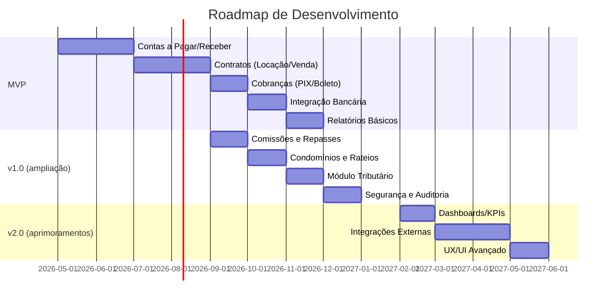

# Resumo Executivo  
Este relatório detalha o projeto de um **módulo financeiro genérico** focado inicialmente em imobiliárias (gestão de locações, condomínios e vendas). O sistema integrará controles de *contas a pagar/receber*, geração de cobranças (boletos, PIX, cartões), fluxo de caixa, cálculo de comissões e repasses, gestão de garantias e cauções, além de acompanhar obrigações fiscais (IPTU, ISS, IR, etc.). As **funcionalidades-chave** incluem emissão automática de cobranças e lançamentos financeiros a partir de contratos de locação/venda【31†L65-L72】, controle de inadimplência, e geração de relatórios como balancetes mensais e demonstrativos de repasses. A conciliação bancária é destacada como “funcionalidade essencial” para alinhar extratos bancários com os lançamentos do sistema【38†L46-L53】.  

Em termos tributários e contábeis, o módulo deve incorporar regras brasileiras específicas: por exemplo, cobrar ISS municipal sobre comissões de corretores (alíquotas de 2% a 5% do serviço【17†L147-L155】) e apurar IRPJ/CSLL e PIS/COFINS conforme regimes (no Lucro Presumido, base de presunção de 32%【35†L194-L203】; atenção ao fato de que “locação de imóveis próprios não é compatível com o Simples Nacional”【45†L39-L42】). Para integração de dados externos, deve-se prever conexão com o sistema SREI (CNJ) para obter matrículas de imóveis, com APIs de pagamento (por exemplo, API Pix do Banco Central【41†L268-L271】) e com bancos para importação de extratos OFX/OFC. A conformidade LGPD (Lei 13.709/2018) será tratada por meio de criptografia de dados sensíveis, controle de acesso por perfis, logs de auditoria e outros mecanismos de segurança【40†L139-L147】.  

O roadmap prioriza um MVP com funcionalidades críticas (contas a pagar/receber, contratos de locação, cobranças automáticas, fluxo de caixa e relatórios básicos). Versões subsequentes (v1, v2) incluirão módulos de comissão/repasses, administração de condomínios (rateios de despesas), integrações ampliadas (ERP, portais imobiliários, cartórios) e aprimoramentos de UX/UI. Esta abordagem escalonada, sem restrições tecnológicas ou orçamentárias, garante flexibilidade de evolução. A seguir apresentamos os requisitos detalhados, casos de uso, regras legais aplicáveis, modelos de dados e demais componentes necessários para o sucesso do projeto.

## Requisitos Funcionais  
- **Contas a Pagar/Receber e Fluxo de Caixa:** Controle completo de todas as contas a pagar (fornecedores, despesas de condomínio, IPTU, etc.) e a receber (aluguéis, vendas de imóveis, multas, etc.). Geração e envio automático de cobranças via **boletos bancários, PIX e cartões de crédito**, com alertas pré-vencimento【31†L39-L42】. O sistema deve consolidar o **fluxo de caixa** mensal, mostrando saldos anteriores, entradas, saídas e saldo projetado【31†L48-L57】.  

- **Gestão de Contratos (Locação e Venda):** Cadastro de contratos de locação e compra/venda, vinculando imóveis, locatários/compradores e proprietários. Para **locação**, incluir dados de garantias (caução, seguro-fiança), reajustes contratuais (IGPM, IPCA, etc.), multas por atraso (contratuais) e rescisões. Para **venda**, registrar o valor de venda, cálculo de imposto de transmissão (ITBI) e repasses ao vendedor. Novos contratos devem gerar automaticamente lançamentos financeiros (receita a receber e provisões de impostos)【31†L65-L72】.  

- **Comissões e Repasses:** Cálculo de comissões de corretores (ex.: 5%-10% de aluguel ou 6%-8% em vendas) e divisão entre corretores envolvidos. Emissão de contas a pagar internas para comissões e contabilização de **ISS sobre a comissão** (2%–5%)【17†L147-L155】. Após recebimento, processamento automático de **repasses líquidos aos proprietários**, abatendo taxas, impostos e comissões【31†L65-L72】. Relatórios detalhados de comissionamento por corretor e histórico de repasses (status pago/pendente)【31†L77-L86】【31†L100-L107】.  

- **Administração de Condomínios:** Criação de empreendimentos condominiais com unidades e frações ideais. Lançamento de **despesas condominiais** (manutenção, empregados, contas de consumo) e rateio automático entre condôminos, conforme convenção. Emissão de boletos mensais de taxa condominial, controle de inadimplência e aplicação de multas condominiais. Relatórios contábeis para prestação de contas ao condomínio, incluindo balancetes mensais【29†L188-L197】【29†L200-L205】.  

- **Garantias e Cauções:** Gestão de depósitos caução recebidos dos locatários – mantidos em conta vinculada e registrados como passivo até a devolução. Cálculo de rendimentos (se aplicável) ou abatimentos por danos, gerando reembolsos ou créditos apropriados. Monitoramento de prazos de devolução conforme a legislação (CR 4.591/64) e emissão de recibos.  

- **IPTU e Encargos:** Inclusão do **IPTU** (imposto municipal sobre propriedade) no sistema, atribuindo-o ao imóvel e lançando-o como despesa do proprietário ou como cobrança ao locatário (segundo contrato). Integração ou importação de carnês municipais, se disponível, ou entrada manual do valor venal (cada município calcula de forma própria). Controle de pagamento de IPTU (via boleto ou débito) e registro no fluxo de caixa. Gestão de outras taxas e emolumentos (ex.: água, luz de áreas comuns, taxa de incêndio), vinculados a condomínios ou proprietários.  

- **Módulos Contábeis Auxiliares:** Contabilização segundo princípios contábeis brasileiros – reconhecer receitas quando auferidas (CPC/IFRS15) e despesas no regime de competência. Suporte a **provisões contábeis** (ex.: provisão de férias/dependentes para empregados do condomínio, provisão para garantias). Lançamentos de rateios de despesas comuns (Ex.: elevador, piscina) entre as partes. Exportação de lançamentos para sistemas contábeis ERP (padrões SPED, contabilidade online).  

- **Relatórios e KPIs:** Geração de relatórios padrão como fluxo de caixa, extrato de imóvel (valores de receitas e despesas por imóvel)【31†L90-L99】, demonstrativo de repasses por proprietário【31†L100-L107】, contas a pagar/receber em aberto e vencidas. Indicadores de desempenho (KPIs) importantes: índice de inadimplência de aluguel, tempo médio de vacância, taxa de ocupação, faturamento mensal, margem operacional, retorno sobre investimento (ROI) dos imóveis e ciclos de vendas. Dashboards visuais (gráficos de fluxo de caixa, de comissões e de receitas por categoria).  

- **Integrações Necessárias:**  
  - **Bancária:** Importação automática de extratos bancários (formatos OFX/OFC) para conciliação【38†L46-L53】. Implementação de APIs de Open Banking/Bacen para iniciar pagamentos e consultar saldos (API Pix oficial do Bacen)【41†L268-L271】. Emissão de cobranças via sistema bancário ou gateway (Pix Cobrança, boleto registrado).  
  - **Pagamentos Eletrônicos:** Conexão com gateways (Cielo, PagSeguro, MercadoPago etc.) para processar cartões de crédito e débito recorrentes. Uso de QR Code Pix e integração com carteiras digitais.  
  - **ERP/Contabilidade:** Integração via webhooks/API ou exportação/importação de dados (XML, CSV) com sistemas ERP populares (TOTVS, Linx, Oracle, etc.) para fechamento contábil e fiscal.  
  - **Portais Imobiliários:** Integração opcional para sincronizar anúncios e leads (ex.: VivaReal, OLX, Zap) via APIs ou RSS/CSV para alimentar cadastro de imóveis.  
  - **Cartórios e SREI (CNJ):** Uso do Sistema de Registro Eletrônico de Imóveis (SREI) do CNJ para obter matricula eletrônica, certidões e verificar ônus reais【13†L487-L491】. A integração com o portal SREI (por ONR) permite automatizar consultas de propriedade e evitar inconsistências cadastrais.  

- **Segurança e LGPD:** Implementar autenticação forte (senhas seguras, 2FA) e autorização por perfil (corretor, síndico, administrador, contador) com permissões restritas. Criptografia de dados sensíveis (documentos pessoais, bancários) em repouso e em trânsito. Logs de auditoria detalhados para registrar ações críticas (acesso a informações confidenciais, alterações financeiras). Políticas de retenção de dados conforme LGPD (13.709/2018). Medidas de segurança como backup diário e políticas de “mesa limpa” são recomendadas【40†L139-L147】. Deve-se designar um DPO interno e disponibilizar canais de contato conforme a lei.  

## Requisitos Não Funcionais  
- **Escalabilidade e Disponibilidade:** Arquitetura escalável (microserviços em nuvem ou containers) para atender muitos usuários simultâneos e base de dados crescente. Uso de cache/distribuição de carga para consultas frequentes (saldo bancário, extrato de contrato). Alta disponibilidade (SLA ≥ 99,9%), com redundância de servidores e failover automático.  
- **Performance:** Latência baixa em operações críticas (inserção de lançamentos, geração de relatório) e processamento em lote fora de pico (conciliação, fechamento mensal). Testes de carga devem simular volume de transações financeiras (por exemplo, milhares de boletos gerados mensalmente).  
- **Segurança:** Normas de segurança (OWASP, ISO 27001) para evitar ataques (injeção SQL, XSS). Autenticação via OAuth2/JWT em APIs, uso de HTTPS/TLS em todas as comunicações. Monitoramento de tentativas de intrusão e resposta a incidentes.  
- **Usabilidade (UX/UI):** Interface amigável e responsiva, acessível por desktop e mobile. Para corretores: dashboard simplificado (novos leads, agendamentos, comissões pendentes). Para administradores: telas de gestão (lotes de contratos, lançamentos em massa). Minimizar cliques para tarefas comuns (por exemplo, “gerar boleto” direto do contrato). Realizar testes de usabilidade para ajustar fluxo de navegação.  
- **Manutenibilidade:** Códigos seguindo padrões MVC e princípios SOLID (como solicitado). Arquitetura orientada a serviços (APIs RESTful bem documentadas). Capacidade de atualizar componentes (como módulos tributários) sem interromper operações. Documentação técnica clara (Swagger/OpenAPI para APIs).  
- **Conformidade Legal:** Registro cronológico de auditoria (quem fez o quê e quando) para fornecer provas em auditorias fiscais. Rotinas de atualização das alíquotas tributárias e regras contábeis conforme mudanças legislativas (por exemplo, atualizações do CPC/IFRS).  
- **Internacionalização/Linguagem:** Sistema multiloja ou multiempresa, configurável para diferentes CNPJs, com planos de contas separados se necessário. Idioma principal em português, mas preparado para outros idiomas futuros.  

## Casos de Uso Detalhados

- **Locação de Imóveis:**  
  1. **Cadastro de Contrato de Locação:** O corretor registra um novo contrato vinculando um imóvel, locatário e proprietário. Define-se valor do aluguel, data de início/término, periodicidade de reajuste (IGPM). A caução (se existir) é registrada como passivo.  
  2. **Emissão de Cobranças:** Mensalmente, o sistema gera cobranças ao locatário (boleto/Pix) com vencimento programado. Caso de atraso, aplica multa e juros (p.ex. 10% multa + 1% juros diário). O locatário pode pagar por diversos meios (PIX, cartão, boleto).  
  3. **Quitação e Rateio:** Ao receber pagamento, o sistema concilia automaticamente com contas a receber e atualiza o fluxo de caixa. Calcula-se a comissão do corretor (porcentagem do valor recebido) e registra uma despesa interna. O saldo remanescente é programado para **repassar ao proprietário**, subtraindo também eventuais despesas (IPTU ou condomínio, se couber ao proprietário). Em caso de serviços (ex.: inquilino paga condomínio atrasado), registra-se como receita de condomínio.  
  4. **Renovação/Rescisão:** Antes do fim do contrato, sistema envia alerta para renovação automática ou negociação de novo termo. Em rescisão, calcula aviso prévio ou penalidades e finaliza as obrigações contratuais. A caução é devolvida (com ou sem descontos).  
  5. **Garantias e Fiadores:** Se houver fiadores ou seguro-fiança, mantém cadastro separado. Em caso de inadimplência, permite geração de boletos de cobrança ao fiador.  

- **Administração de Condomínios:**  
  1. **Criação de Condomínio:** Define-se condomínio com unidade por unidade e frações ideais. Cada unidade associa-se a um proprietário (clientela do sistema).  
  2. **Lançamento de Despesas Condominiais:** O síndico/admin registra despesas mensais (água, luz, limpeza, salários de funcionários, manutenção). O sistema realiza *rateio automático* dessas despesas entre todas as unidades ou grupos definidos (ex.: por área).  
  3. **Cobrança de Taxas:** Emite boletos mensais de taxa condominial por unidade. Controla inadimplência (notificações e multas internas). Atualiza o fluxo de caixa do condomínio e reflete no balancete.  
  4. **Prestação de Contas:** Ao fim de cada período (mensal/anual), o sistema gera relatórios contábeis para os condôminos: balancetes, demonstrativo de taxas pagas e despesas, folha de pagamento. Auxilia no cálculo de rateios extraordinários e provisionamento de fundo de reserva.  

- **Compra e Venda de Imóveis:**  
  1. **Registro de Venda:** O corretor insere uma venda formalizada, incluindo preço de venda, dados do comprador, do vendedor e do imóvel. Calcula-se o imposto de transmissão (ITBI) e custos de registro/cartório (custas de escritura).  
  2. **Cálculo de Comissões:** Define-se a comissão total (por ex. 6% do valor de venda) e divide-se entre corretores envolvidos. Lança-se essa comissão como despesa, aplicando ISS sobre a intermediação.  
  3. **Fechamento Financeiro:** Uma vez pago pelo comprador (pix, boleto ou financiamento), o sistema concilia o recebimento. Repasse líquido ao vendedor é determinado subtraindo-se tributos, comissões e despesas intermediárias.  
  4. **Documentação:** Gera recibos de corretagem, contrato de venda (por integração com sistema de documentos, se houver), e, opcionalmente, envia para registro em cartório via SREI (quando o registro eletrônico estiver disponível para o usuário).  

- **Comissões e Repasses:**  
  - **Cálculo Automático:** A cada recebimento de aluguel ou venda, o módulo calcula as comissões devidas (automático pela regra definida) e atualiza o relatório de comissões【31†L82-L90】.  
  - **Divisão:** Em vendas complexas, permite ratear a comissão entre vários corretores com percentuais pré-definidos.  
  - **Repasses a Proprietários:** Após a competência do recebimento e apuração de comissões, o módulo cria instruções de repasse (parcelado ou único) para transferir o valor líquido aos proprietários via TED/DOC, registrando nos *contas a pagar* do proprietário. Exibe histórico de repasses efetivados e pendentes【31†L100-L107】.  

- **Garantias/Cauções:**  
  - **Depósito em Garantia:** Ao iniciar contrato de locação, o locatário pode depositar caução (por ex. 3 aluguéis). O módulo registra o valor como *passivo* na imobiliária/administradora (até devolução). Durante o contrato, armazena juros devidos (se regra contratual) ou saldos devedores.  
  - **Devolução/Forfeit:** Ao final do contrato, permite lançar devolução da caução ao locatário ou aplicação de descontos (danos ao imóvel), gerando as devidas receitas para o proprietário ou multas para o locatário.  

- **IPTU e Multas:**  
  - **IPTU:** Insere-se carnê de IPTU do imóvel (anual ou parcelado). O sistema pode repassar o boleto do IPTU ao locatário (se acordado) ou pagar diretamente, registrando nos lançamentos de condomínio. Em ambos os casos, a obrigação fiscal municipal é atendida.  
  - **Multas Contratuais:** Multas por infrações de contrato (atraso, infração de regras) são lançadas como receitas adicionais para o proprietário e como contas a receber adicionais do inquilino, conforme política contratual (emissão de boleto extra).

## Regras Fiscais, Tributárias e Contábeis Brasileiras  

- **Tributação de Receitas Imobiliárias:** Aluguel recebido por pessoa jurídica enquadrada no *Lucro Presumido* sofre presunção de 32% da receita para IRPJ/CSLL (15% + adicional IRPJ)【35†L194-L203】. PIS/COFINS incidem nas receitas (0,65% e 3% sobre o bruto)【35†L194-L203】. Já a intermediação de imóveis configura serviço tributável pelo ISS municipal (2–5%)【17†L147-L155】. Observa-se que, por Resolução CGSN 140/2018, atividade de locação de imóveis próprios é vedada no Simples Nacional【45†L39-L42】, devendo ser tributada via Lucro Presumido ou Real.  

- **ISS sobre Corretagem:** Segundo a Lei Complementar nº 116/2003, a corretagem imobiliária gera ISS. A alíquota efetiva é definida pelo município, porém a lei fixa de 2% a 5% sobre o serviço prestado【17†L147-L155】. O módulo deve permitir parametrizar a alíquota de ISS por localidade e destacá-lo em documentos de cobrança e retenção (se o pagamento for via retenção de serviço).  

- **Imposto de Renda (Pessoa Física e Jurídica):** Em vendas de imóveis por pessoa física (PJ ou PF), apura-se ganho de capital (Declaração GCAP). Para pessoas jurídicas, lucros decorrentes de venda de bens do ativo imobilizado podem gozar de diferimento ou isenções (por ex., entidades sem fins lucrativos beneficiárias do art. 15 da Lei 9.532/97 mantêm isenção de IRPJ sobre aluguel ativo, desde que receitas reinvestidas nas atividades fins【33†L15-L22】). O módulo deve auxiliar no cálculo de retenções na fonte aplicáveis (ex.: IRRF 1,5% em serviços de administração de bens).  

- **Tributos Municipais e Estaduais:** Registro e pagamento de IPTU (imposto municipal), de responsabilidade do proprietário, mas muitas vezes lançado no módulo para controle. Em casos de venda de imóvel urbano, o ITBI (geralmente ~2% do valor de venda) deve ser apurado pelo usuário do sistema (pois varia por município). Isenções e reduções possíveis (por idade, doença, grande imóvel) devem ser configuráveis caso a caso.  

- **Contabilidade Específica:** Deverão ser atendidos princípios das **Normas Brasileiras de Contabilidade**. Por exemplo, a NBC T 10.5 (Entidades Imobiliárias) e o CPC 47 (Receita de Contratos) orientam o reconhecimento de receitas e custos em incorporação e venda de unidades imobiliárias. O módulo financeiro deve gerar lançamentos compatíveis com um plano de contas adequado, com provisionamento de receitas e despesas no regime de competência, permitiendo a exportação para demonstrativos contábeis (balanço, DRE).  

- **Escrituração e Obrigações Acessórias:** Emissão de notas fiscais de serviços (no caso de administradora prestando serviços de gestão); geração de livro caixa para autônomos corretores; exportação de dados para entrega de obrigações como SPED Fiscal/Contábil (se necessário); GUIs para DARF (IR, CSLL), GPS (INSS sobre folha de condomínio), DCTFWeb e EFD-Reinf para encargos de condomínios. Para condomínios, considerar que mesmo entidades simples devem enviar RAIS/Dirf/IRPJ quando aplicável【45†L73-L81】.  

## Modelos de Dados (ERD) e Esquemas de Tabelas  

O modelo conceitual envolverá entidades principais como *Imóvel, Pessoa (Corretor, Cliente, Proprietário, Inquilino), Contrato, ContaFinanceira, LançamentoFinanceiro, Comissão, Pagamento* e vínculos (associações). Por exemplo:  

```mermaid
erDiagram
    PESSOA ||--o{ CONTRATO : firma
    IMOVEL ||--o{ CONTRATO : locado_por
    CONTRATO }o--o{ LANCAMENTO : gera
    CONTRATO ||--o{ COMISSAO : define
    PESSOA ||--o{ COMISSAO : recebe
    PESSOA ||--o{ PAGAMENTO : faz
    PAGAMENTO }o--|| LANCAMENTO : quita
    IMOVEL ||--o{ TAXA : possui
    PESSOA ||--o{ PAGAMENTO : recebe_pago
    ```
- *Tabela `Pessoa`* (id, nome, tipo [Cliente, Corretor, Proprietário, etc.], CPF/CNPJ, endereço, contatos).  
- *Tabela `Imovel`* (id, endereço, tipo, valor_venal, proprietário_id, metragem).  
- *Tabela `Contrato`* (id, tipo [Locação/Venda], imovel_id, locatario_id, corretor_id, data_inicio, data_termino, valor, periodicidade_reajuste, status).  
- *Tabela `LancamentoFinanceiro`* (id, contrato_id, pessoa_id, descricao, tipo [Receita/Despesa], categoria, valor, data_vencimento, data_pagamento, conta_bancaria_id, status).  
- *Tabela `Comissao`* (id, contrato_id, corretor_id, percentual, valor, data_geracao).  
- *Tabela `Pagamento`* (id, lancamento_id, data_pagamento, meio_pagamento [PIX, Boleto, Cartão], comprovante, valor_liquido).  
- *Tabela `ContaBancaria`* (id, banco, agencia, conta, saldo_atual).  
- *Tabela `TarifaTaxa`* (id, imovel_id, tipo [IPTU, Condomínio, Multa], valor, vencimento).  

Os relacionamentos e atributos serão ajustados conforme a necessidade de reportes (por exemplo, campos de observação, centros de custo, notas fiscais emitidas).  

## Fluxos Financeiros, Conciliação e Rateios  

- **Fluxo de Caixa:** Diagrama-se o fluxo de entrada e saída de recursos. Por exemplo, um pagamento de aluguel flui: *Locatário → (PIX/BOLETO) → Conta Bancária da Imobiliária → Sistema*; então o sistema aloca: repassa comissão ao corretor e cria ordem de transferência para o proprietário.  

```mermaid
flowchart LR
    Locatario-->|Pagamento (PIX/Boleto)|Banco
    Banco-->|Importa extrato (OFX/OFC)|Sistema
    Sistema-->|Concilia & Atualiza fluxo|LancamentoFinanceiro(Aluguel)
    Sistema-->|Calcula Comissao|LancamentoFinanceiro(Comissao)
    Sistema-->|Agenda Repassse|Pagamento(Repassar\_ao\_Proprietario)
    Sistema-->|Registra Tributos|LancamentoFinanceiro(IPTU/ISS/etc)
```

- **Conciliação Bancária:** Importar extratos bancários regularmente e casá-los com lançamentos do sistema【38†L46-L53】. Discrepâncias são sinalizadas para conferência. Regras automáticas (por palavra-chave) sugerem categorias para lançamentos não reconhecidos.  

- **Rateios e Provisões:** Despesas de condomínio e IPTU podem ser rateadas proporcionalmente (ex.: fração ideal de cada unidade). O módulo suporta rateios definidos (ex.: custo dividido igualmente ou por metragem). Calcula provisões mensais (ex.: fundo de reserva). No caso de vendas, provisiona-se IRRF sobre comissão se aplicável.  

- **Demonstrações Financeiras:** Embora o escopo seja operacional, o módulo deve facilitar exportação para relatórios contábeis padronizados (balanços, DRE) e acompanhamento de KPIs financeiros (liquidez, margem).  

## Integrações Necessárias  

- **API Pix (Banco Central):** Conforme especificação oficial do BACEN【41†L268-L271】, integrar a API Pix para geração de cobranças com QR Code, pagamentos instantâneos e consultas de status. Utilize certificados digitais e padrões OpenAPI fornecidos pelo Bacen.  
- **Bancos (Open Banking):** Implementar as APIs de Open Banking / Open Finance (Conciliação automática de contas, agendamento de Pix via PSD2). As instituições financeiras brasileiras hoje exigem autenticação forte (OAuth2) e seguem normas do Banco Central.  
- **Gateways de Pagamento:** APIs RESTful de intermediários para boletos e cartões. Exemplo: o PagSeguro, MercadoPago e PICPAY fornecem endpoints HTTP para criação de cobranças e consulta de pagamentos.  
- **Portais Imobiliários:** Caso disponível, integrar via API proprietária (ex.: Zap Imóveis não libera API pública; mas CRMs imobiliários às vezes fazem integrações customizadas). Pelo menos, possibilitar exportação para feeds ou compartilhamento de base de imóveis.  
- **ERP/Contábil:** API ou arquivos (XML/SPED/CNT) para enviar lançamentos contábeis. Sistemas como TOTVS/Senior têm SDKs para integração de módulos financeiros e fiscal (por ex., registro de NF-e de serviços de corretagem).  
- **Cartório (CNJ/SREI):** Uso de APIs SREI para obter matrícula do imóvel e validação de propriedade【13†L487-L491】. Embora não haja API pública unificada ainda, a tendência é que o sistema oficial SREI passe a oferecer integração assíncrona (mensageria ONR).  

## Segurança, Auditoria e Conformidade LGPD  

- **LGPD (Lei 13.709/2018):** Mapear todos os dados pessoais (CPF, CNPJ, histórico de crédito, etc.) no sistema. Aplicar *privacy by design*: consentimento explícito (quando necessário), bases legais documentadas (execução de contrato, obrigação legal, legítimo interesse)【40†L139-L147】.  
- **Criptografia e Controle de Acesso:** Dados pessoais e bancários devem ser criptografados em banco de dados. Utilizar controle de acesso por funções (p.ex. somente contadores acessam relatórios financeiros completos). Autenticação multifator reduz risco de violação. Conforme recomendação legal, investir em **criptografia de ponta a ponta** e backups seguros【40†L139-L147】.  
- **Auditoria:** Logar todas as operações críticas (criação/edição de contratos, lançamentos, pagamentos, alterações cadastrais) com timestamp e usuário. Esses logs devem ser imutáveis e disponíveis para auditoria interna ou externa. Relatórios de auditoria devem ser gerados sob demanda.  
- **Segurança de Infraestrutura:** Firewalls, monitoração contínua (IDS/IPS), e testes de invasão periódicos. Cumprir padrões do Banco Central para sistemas financeiros (sobregrau de segurança). Em especial, lidar com incidentes e manutenção de certificação digital (ICP-Brasil) para assinaturas eletrônicas.  

## Requisitos de Performance, Escalabilidade e Disponibilidade  

- **Performance:** O sistema deve suportar picos mensais de processamento (ex.: no dia de fechamento de mês condominial). Espera-se, por exemplo, gerar e enviar milhares de boletos em lote sem degradação significativa.  
- **Escalabilidade Horizontal:** Arquitetura modular que permita replicar serviços (ex.: motor de cálculo de boletos, web API, banco de dados) conforme aumento de usuários. Uso de containers/Kubernetes facilita escalonamento automático de acordo com uso.  
- **Alta Disponibilidade:** Meta de 99,9% uptime (menos de 10 minutos de indisponibilidade por semana). Utilizar clusters redundantes e balanceamento de carga. Planos de disaster recovery e failover devem estar documentados.  
- **Internacionalização:** Embora focado no Brasil, arquitetura deve permitir futura tradução e ajuste de formatos (moeda, data).  
- **Front-end Responsivo:** Carregamento rápido nas páginas críticas (contratos e financeiro) – otimizações via lazy loading, minimização de assets. Testes de performance (benchmark com JMeter/LoadRunner) devem ser executados.  

## UX/UI para Corretores e Administradores  

- **Painel do Corretor:** Visão clara de tarefas diárias (novas propostas, contratos pendentes, boletos vencidos, comissões a receber). Acesso rápido a cadastro de leads e imóveis. Design clean, usa elementos visuais (status coloridos). Mobile-first: app ou web responsivo para facilitar consulta em campo.  
- **Painel do Administrador:** Dashboard com gráficos de fluxo de caixa, ranking de comissões, contas em atraso. Filtros e busca avançada (por cliente, imóvel, vencimento). Interfaces de cadastro em forma de wizard (para contratos longos) e formulários com validações em tempo real (ex.: CPF válido, datas cronológicas).  
- **Acessibilidade:** Seguir normas básicas (contraste, navegação por teclado). Legendas e explicações em linguagem simples nos formulários.  

## APIs e Contratos Técnicos  

Todas as integrações serão via APIs RESTful com JSON. Exemplos de endpoints e fluxos:  

- **Autenticação:** `/api/login` retorna JWT com escopos; cabeçalhos `Authorization: Bearer <token>`. Proteção de endpoints sensíveis.  
- **Exemplo de recurso Contrato:**  
  ```json
  GET /api/contratos/123
  {
    "id": 123,
    "tipo": "locacao",
    "imovel": {"id":10,"endereco":"Av. Brasil, 100"},
    "locatario": {"id":5,"nome":"João Silva"},
    "valor": 2500.00,
    "inicio": "2026-01-01",
    "fim": "2027-01-01",
    "status": "ativo"
  }
  ```  
- **Lançamento de Pagamento:**  
  ```json
  POST /api/pagamentos
  {
    "lancamento_id": 456,
    "data_pagamento": "2026-04-15",
    "valor_pago": 1500.00,
    "metodo": "PIX",
    "comprovante": "base64string"
  }
  ```  
- APIs de integração bancária seguirão padrões Open Banking (registro de consentimento, uso de certificados). Documentação técnica (OpenAPI/Swagger) detalhará cada endpoint, incluindo exemplos de resposta e códigos de erro.  

## Testes, QA e Checklist de Implantação  

- **Testes Unitários/Integrados:** Cobrir lógicas tributárias, cálculo de comissões, gerador de boletos e simulações de fluxo de caixa. Garantir > 90% de cobertura.  
- **Testes de Interface:** Testes automatizados de UI (Selenium/Cypress) para fluxos críticos (emissão de boleto, conciliação, geração de contrato).  
- **Testes de Segurança:** Análise de vulnerabilidades (SA, scanners SAST/DAST) em código e APIs. Auditoria de dependências (Snyk, OWASP).  
- **Testes de Performance:** Carga em módulos de faturamento (por exemplo, simular emissão de 10.000 boletos). Monitorar consumo de CPU/memória e latência.  
- **Checklist Pré-Implantação:**  
  - Ambiente homologação configurado com base de dados de teste.  
  - Procedimentos de migração de dados (cadastros existentes) definidos.  
  - Políticas de backup agendadas para banco de dados e arquivos (logs).  
  - Treinamento básico para usuários (manual simplificado e vídeos tutoriais).  

## Estimativa de Esforço e Roadmap de Funcionalidades  

| Funcionalidade                                   | Esforço Est. (pessoa-mês) | Prioridade | Versão  |
|--------------------------------------------------|---------------------------|------------|---------|
| Contas a Pagar/Receber e Fluxo de Caixa          | 3                         | Alta       | MVP     |
| Cadastro de Contratos (Locação/Venda)            | 4                         | Alta       | MVP     |
| Emissão Automática de Boletos/PIX                | 2                         | Alta       | MVP     |
| Integração Bancária (Importação de Extratos)     | 2                         | Alta       | MVP     |
| Relatórios Básicos (Balancetes, Extratos)        | 2                         | Alta       | MVP     |
| Cálculo de Comissões e Repasses                  | 2                         | Média      | v1.0    |
| Gestão de Condomínios (Rateios de Despesas)      | 2                         | Média      | v1.0    |
| Módulo Tributário (ISS, IR, PIS/COFINS, IPTU)    | 3                         | Média      | v1.0    |
| Dashboard Avançado e KPIs                        | 2                         | Média      | v2.0    |
| Integrações ERP/Contábil e Portais Imobiliários  | 3                         | Média      | v2.0    |
| Segurança Avançada (Criptografia, Auditoria)     | 3                         | Alta       | v1.0/v2.0 |
| Melhorias UX/UI (Mobile, Dashboards)             | 2                         | Baixa      | v2.0    |
| APIs Externas (Open Banking, SREI)               | 3                         | Média      | v2.0    |

Esse roadmap (ilustrado abaixo) posiciona o **MVP** para o primeiro semestre, cobrindo as funcionalidades críticas. A versão 1.0 (segundo semestre) adiciona comissões, condomínios e tributos, enquanto a versão 2.0 foca em melhorias de integração e usabilidade.  



**Conclusão:** O módulo financeiro projetado será robusto e flexível, combinando as melhores práticas de contabilidade e tecnologia. Ele permitirá que imobiliárias e corretores administrem totalmente as finanças do negócio (alugueis, vendas, condomínios, comissões), garantindo conformidade legal e visibilidade financeira. As fontes consultadas incluem publicações oficiais (CNJ, Receita Federal), manuais de contabilidade e sites técnicos (por exemplo, descrições de sistemas imobiliários【31†L19-L22】【38†L46-L53】), assegurando que todas as regras e funcionalidades sejam abordadas de forma fundamentada e atualizada.  

**Fontes:** Legislação brasileira e documentação técnica citadas ao longo do texto【13†L487-L491】【17†L147-L155】【35†L194-L203】【38†L46-L53】【40†L139-L147】【41†L268-L271】【45†L39-L42】【29†L192-L200】【31†L19-L22】【31†L65-L72】. Cada referência está incluída no contexto correspondente.