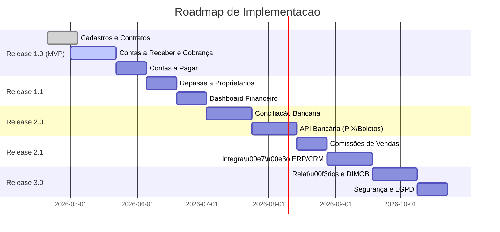
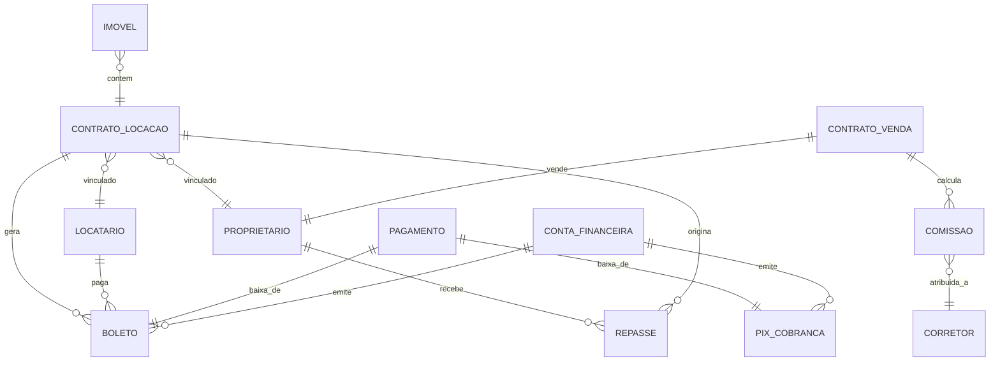

# Resumo Executivo

O **módulo financeiro imobiliário** é uma solução integrada para gerir todos os aspectos contábeis e fiscais de aluguel e venda de imóveis. Ele atende imobiliárias, corretores, administradoras de condomínios, proprietários e compradores, automatizando **contas a pagar/receber**, conciliando extratos bancários e calculando repasses e comissões com conformidade às leis brasileiras (ISS, IRRF, DIMOB etc.). O sistema permite gerar cobranças por boleto ou PIX, acompanhar inadimplência, emitir notas fiscais de serviços e fornecer relatórios financeiros detalhados (fluxo de caixa, DRE, aging de contas). Como MVP, prioriza cadastros de contratos (locação e venda), gestão básica de contas e cobranças. Em releases subsequentes, adiciona funcionalidades como conciliação bancária automatizada, integrações com bancos (CNAB/PIX) e ERPs, dashboards de KPIs e compliance fiscal avançado. A arquitetura recomendada é em camadas (MVC), respeitando princípios SOLID e desacoplamento, com ênfase em segurança, escalabilidade e disponibilidade. 

# Visão Geral do Produto

O módulo financeiro para imobiliárias consolida todas as rotinas financeiras relacionadas a **locação e venda de imóveis**. Ele permite cadastrar imóveis, contratos de locação e vendas, gerar boletos/PIX de cobrança de aluguéis e prestações, controlar contas a pagar (despesas, impostos) e contas a receber (aluguéis, comissões). O sistema calcula automaticamente repasses aos proprietários (deduzindo taxas de administração, provisões e impostos), além de comissões de corretores. Prevê emissão de notas fiscais de serviços (NFS-e) e guias de DARF conforme as retenções de ISS e IRRF【18†L159-L168】【13†L152-L160】. O produto também gera obrigações acessórias do setor imobiliário – por exemplo, declarações DIMOB – e entrega dashboards com KPIs financeiros. A interface oferece telas para gestão de contratos, cobrança, conciliação bancária e relatórios, integrando dados de diferentes fontes (bancos, ERPs, CRM). A solução é configurável para qualquer porte de negócio imobiliário, mas estruturada para atender especificamente imobiliárias, administradoras, proprietários e profissionais de vendas de imóveis, garantindo **transparência** e **eficiência** na gestão financeira do setor.

# Objetivos e Público-Alvo

**Objetivos principais:** racionalizar a gestão financeira das imobiliárias, reduzir erros manuais e assegurar conformidade legal. Entre os objetivos específicos estão:  
- Facilitar o **controle de fluxo de caixa** (prevendo receitas de aluguéis e vendas).  
- Automatizar cobranças mensais (boletos e PIX) e baixa de pagamentos.  
- Calcular repasses a proprietários com retenções fiscais e emitir notas fiscais de administração.  
- Calcular e controlar **comissões de vendas** de corretores (incluindo divisão de comissões).  
- Simplificar a conciliação bancária com importação de arquivos padrão (CNAB) ou APIs bancárias.  
- Atender obrigações fiscais brasileiras como **DIMOB**, IRRF e ISS, garantindo **compliance** contábil.  

**Público-alvo:** o módulo se destina a **imobiliárias e administradoras de condomínio**, **corretores de imóveis**, **proprietários de imóveis** (que recebem aluguel via intermediadoras) e **compradores de imóveis** (no contexto de controle financeiro do negócio). Ele deve ser útil também a contadores e equipes financeiras que prestam serviço a esse segmento, fornecendo informações claras e relatórios gerenciais para todos os stakeholders.

# Escopo Mínimo Viável (MVP) e Roadmap de Releases

**Escopo Mínimo Viável (MVP):** o MVP inclui as funções essenciais para começar a operar:  
- **Cadastros básicos:** imóveis, locatários, proprietários, corretores.  
- **Gestão de contratos:** registrar contratos de locação (dados de valor, prazo, reajuste) e de venda.  
- **Contas a Receber:** geração de títulos de cobrança (boletos e chaves PIX) para aluguéis e parcelas de venda.  
- **Contas a Pagar:** cadastro de despesas fixas/variáveis e impostos vinculados aos imóveis.  
- **Recebimentos:** registro de pagamento manual e importação de retorno bancário (CNAB) para baixa automática de boletos.  
- **Repasses aos proprietários:** cálculo simples de repasses (aluguel – comissão – taxas), sem nota fiscal nesse primeiro momento.  
- **Dashboard básico:** resumo de saldos, recebedores em aberto e pagamentos atrasados.  

**Roadmap de funcionalidades (por release):**  



- **Release 1.0:** funcionalidades básicas de cadastro e ciclo financeiro (AP/AR).  
- **Release 1.1:** início de repasses aos proprietários e visualização de indicadores financeiros.  
- **Release 2.0:** conciliação bancária automatizada e integração com APIs de pagamento (PIX, boletos).  
- **Release 2.1:** cálculo de comissões e sincronização de dados com ERP/CRM.  
- **Release 3.0:** geração de relatórios avançados (DRE, extrato de repasses) e cumprimento de obrigações fiscais (DIMOB), além de reforços de segurança e privacidade.  

Cada release é dividido em sprints ágeis, com entregas incrementais validadas pelos usuários (aceitação de inquilinos, corretores e administradores).

# Requisitos Funcionais

- **Contas a Receber:** o sistema deve emitir cobranças periódicas de aluguéis (boleto bancário com registro CNAB e QR Code PIX). Deve permitir parcelamentos de venda de imóvel e cobrança de taxas (ex. condomínio). As cobranças podem ser conciliadas automaticamente pela leitura de arquivos CNAB-240/400 de retorno ou APIs de bancos. Debitos recorrentes devem ser gerados por calendário.  

- **Contas a Pagar:** permitir lançamento de despesas fixas (IPTU, condomínio, manutenção, seguros) vinculadas a cada contrato ou imóvel, com controle de vencimento e pagamento (QR Code PIX ou transferência). Suportar lançamento de despesas extraordinárias no contrato (reforma, multas, etc.). Agendar pagamentos e gerar relatórios de fluxo de contas a pagar futuras.  

- **Conciliação Bancária:** importar extratos bancários (CNAB ou Open Banking) e conciliar lançamentos com títulos pendentes (boletos). Deve identificar por referência e valor, lançando baixas automáticas ou sugerindo partidas. Exibir discrepâncias (diferença entre valor cobrado e pago) para correção manual.  

- **Gestão de Contratos de Locação:** cadastrar contratos informando locador, locatário, fiador(s), valor do aluguel, carência e reajuste (IGPM/INCC). Permitir reajustar periodicamente os aluguéis por índice configurável. Controlar garantias locatícias (caução, seguro-fiança) no contrato. Gerenciar renovações e encerramentos de contratos.  

- **Cobrança de Aluguel e Locação:** gerar mensalmente cobranças de aluguel e encargos, emitir boletos com código de barras e/ou PIX. Registrar pagamentos e emitir recibos ou carnê-leão para locador, conforme regra fiscal. Manter histórico de inadimplência. Enviar notificações (e-mail/SMS) de boletos vencidos e alertas de atraso.  

- **Repasses a Proprietários:** após recebimento do aluguel, calcular o montante a ser repassado ao proprietário (aluguel bruto – comissão da imobiliária – taxas de manutenção). Abater provisões (ex.: taxa de condomínio, IPTU) se necessário. Emitir relatório de repasse detalhado (no MVP) e, em release avançado, criar nota fiscal de serviço (administração de imóveis) para o valor da comissão.  

- **Comissões de Vendas:** registrar vendas de imóveis associadas a uma ou mais comissões de corretagem. Calcular automaticamente a comissão de cada corretor (ex.: 6% do valor de venda, dividido se houver parceria) e emitir recibos ou notas fiscais de prestação de serviços, retendo IRRF e ISS conforme legislação (ver *Regras Fiscais*). Incluir possibilidade de dividir comissões entre corretores.  

- **Provisões e Retenções:** suportar provisões contábeis para despesas futuras (por exemplo, melhorias a serem custeadas). Aplicar retenções obrigatórias: **IRRF sobre aluguéis pagos a pessoa física** e **sobre comissões a pessoas físicas**, conforme tabelas progressivas【3†L168-L174】【18†L159-L168】; **ISS municipal (2–5%)** sobre comissões de corretagem【13†L152-L160】. Calcular e demonstrar DARF devido (códigos 3208 para aluguel à PF【3†L199-L203】, 0588/8045 para corretagem a PF【18†L159-L168】) e guardá-lo para emissão.  

- **Formas de Pagamento:** permitir pagamento das contas por PIX (instantâneo) e boletos registrados. Para boletos, gerar arquivos de remessa padrão Febraban (CNAB) para registro nos bancos e interpretar arquivo de retorno. Para PIX, integrar à **API Pix do Banco Central**【22†L268-L270】 para criar cobranças (cobrança imediata ou QR Codes estáticos/dinâmicos) e consultar status. Oferecer meios alternativos: cartões de crédito via gateway, integrando posteriormente se necessário.  

- **Integrações:** 
  - **Bancos/PIX:** usando APIs padronizadas (CNAB 240/400 e APIs Pix do BACEN) para emitir boletos e cobrar via PIX【22†L268-L270】.  
  - **ERP/Contabilidade:** exportar lançamentos contábeis (integrar a sistemas contábeis como Totvs Protheus, SAP, Odoo) por arquivos SPED ou APIs próprias de ERP. Sincronizar plano de contas e lançar DRE/BS.  
  - **CRM/Portais Imobiliários:** (opcional) conectar-se a CRMs ou portais (Ex: Salesforce, HubSpot, ou integrações de mercado imobiliário) para importar dados de clientes e contratos.  
  - **Governo/Taxes:** gerar DIMOB para Receita Federal (IN RFB 1.115/2010) e, futuramente, integrar Webservices de NFSe para emitir notas eletrônicas (dependendo da cidade).  
  - **Outros Sistemas:** integração com gateways de pagamento e antifraude, além de APIs de consulta de CNPJ/CNPJQR (ex.: ReceitaWS) para validação cadastral.  

- **Fluxos Operacionais:** incluir telas e processos (workflow) para cada caso de uso crítico: ex. emissão de boleto, baixa de pagamento, geração de DARF, repasse de aluguel. Validar dados obrigatórios (ex.: alíquotas de ISS por município).  

  

# Requisitos Não Funcionais

- **Segurança:** criptografia de dados sensíveis (tokenização de senhas, TLS nas comunicações), controle de acesso baseado em funções (admin, gerente, corretor, contábil). Auditoria completa de transações financeiras. Conformidade com LGPD: tratar dados pessoais de locatários e proprietários de forma consentida e segura. Uso de frameworks e bibliotecas auditadas (ex. Spring Security, .NET Identity).  
- **Performance:** o sistema deve responder rapidamente mesmo com grande volume de títulos e contratos. Deve suportar consultas de relatórios em milissegundos e processar rotinas diárias (concilição, cobrança) dentro do dia útil. Otimização de consultas, uso de cache inteligente e índices em banco de dados.  
- **Escalabilidade:** arquitetura modular (microserviços ou modules desacoplados) para permitir crescimento: adicionar novos clientes/imobiliárias sem reescrever o sistema. Uso de serviços em nuvem (AWS, Azure, etc.) com auto-scaling para lidar com picos (ex.: meses de geração de boletos).  
- **Disponibilidade:** alta disponibilidade (mínimo 99,5%) em virtude das demandas de cobranças e repasses mensais. Arquitetura redundante (ex.: replicação do banco de dados, balanceamento de carga) e planos de recuperação de desastres (backups diários, failover).  
- **Conformidade Fiscal/Contábil:** gerar relatórios e exportar dados no formato exigido pela legislação (livro Caixa, SPED Fiscal/Contábil). Abertura de logs contábeis auditáveis para fechamentos mensais. Seguir normas contábeis brasileiras (CPC/BR GAAP para reconhecimento de receitas e provisões).  
- **Manutenibilidade:** código baseado em padrões MVC, SOLID e injeção de dependências para facilitar evolução. Testes automatizados (unitários e integração) cobrindo regras fiscais e financeiras. Documentação da API (OpenAPI/Swagger).  

# Integrações e APIs

| Integração               | Endpoints / Dados Essenciais                                                | Observações                                         |
|--------------------------|-----------------------------------------------------------------------------|-----------------------------------------------------|
| **PIX (Bacen)**          | POST `/pix/v2/cob` (gerar cobrança), GET `/pix/v2/cob/{txid}` (status)     | Especificação oficial da API Pix do BACEN【22†L268-L270】. Cria cobranças imediatas ou QR Code. |
| **Boletos (Febraban)**   | Arquivos CNAB 240/400: envio de remessa (`Cobrança Registrada`), leitura de retorno | Padrão Febraban para emissão de boletos e reconciliação bancária.                     |
| **ERP/Contabilidade**    | APIs de lançamento contábil ou SPED export (DRE, BS)                         | Exportar lançamentos financeiros e contábeis (integrar com Totvs, SAP, etc.).         |
| **Notas Fiscais (NFS-e)**| API de Prefeitura (se disponível) para emissão de NFS-e (administração)     | Emissão de Nota de Serviços para taxas de administração e corretagem (retenção de ISS). |
| **CRM/Vendas**           | API de CRM (REST) para sincronizar clientes e contratos                      | Ex.: dados de leads/corretores de Salesforce ou HubSpot para associar vendas.         |
| **Portal Imobiliário**   | API de portais (ex.: OLX Imóveis, ZAP) para atualizar anúncios/informações   | (Opcional) Sincronizar dados de imóveis; pouco usado em módulo financeiro.            |
| **Receita Federal**      | Programa DIMOB (IN RFB 1115/2010)                                            | Gera arquivo DIMOB para declaração anual (obrigatório)【17†L171-L179】【36†L121-L124】. |
| **Open Banking**         | APIs padrão Bacen para acesso a extratos e transferências bancárias          | (Futuro) Pode usar Open Finance para conciliar contas sem CNAB.                      |

Cada integração deve tratar autenticação (certificado digital, OAuth2 etc.) e restrições de cada parceiro. É fundamental mapear campos essenciais (ex.: txid do PIX, código de barras do boleto, dados do pagador).

# Modelo de Dados (ER) 



Neste modelo simplificado, **ContratoLocacao** relaciona-se a locatário e proprietário, gera boletos/PIX de cobrança e origina repasses mensais. **ContratoVenda** liga-se ao proprietário vendedor e à comissão do corretor. Entidades de pagamento baixam cobranças (boleto/PIX) e vinculam-se a contas financeiras bancárias. Esse modelo deve ser refinado em projetos de DDD com entidades de domínio (Invoice, AccountEntry, etc.).

# Telas e Fluxos de Usuário

**Fluxo principal de cobrança de aluguel:** 

```mermaid
flowchart LR
    subgraph Cobrança de Aluguéis
      A[Gerar cobrança do mês (boleto/PIX)] --> B[Locatário recebe cobrança]
      B --> C[Locatário paga (boleta pago / PIX efetivado)]
      C --> D[Sistema concilia automaticamente]
      D --> E[Gera provisão de repasse]
      E --> F[Emitir relatório de repasse ao proprietário]
    end
```

- **Fluxo detalhado:** O gestor clica em “Gerar cobranças” e o sistema emite boletos e chaves PIX. O inquilino efetua o pagamento. No dia seguinte, o sistema importa extrato bancário e concilia: encontra o pagamento e dá baixa no boleto/PIX. Em seguida, calcula o valor líquido a ser repassado ao proprietário (bruto menos taxa de administração) e gera o comprovante de repasse.  

**Fluxo de venda de imóvel e comissão:**

```mermaid
flowchart LR
    subgraph Venda Imobiliária
      V1[Registrar proposta de venda] --> V2[Finalizar venda (contrato)]
      V2 --> V3[Calcular comissão de corretagem]
      V3 --> V4[Gerar recibo/NFSe de comissão]
      V4 --> V5[Recebimento do comprador]
      V5 --> V6[Sistema registra o pagamento recebido]
      V6 --> V7[Sistema parcela e paga comissão ao corretor]
    end
```

- **Fluxo detalhado:** Ao concluir a venda, o usuário informa detalhes (valor, intermediadores). O sistema calcula a comissão e permite dividir entre corretores. Emite recibo ou NFS-e e calcula retenções (IRRF, ISS)【18†L159-L168】【13†L152-L160】. Ao receber pagamento do comprador (geralmente via transferência bancária), registra-se no sistema e realiza pagamento ao corretor descontando as retenções.

# Relatórios e Dashboards

O produto deve oferecer relatórios e painéis de controle (dashboards) para análise financeira. Exemplos incluem:  

- **Fluxo de Caixa:** gráfico comparando receitas (aluguéis e vendas) versus despesas no período.  
- **Aging de Contas a Receber:** lista de boletos/pix vencidos e prazo médio de recebimento.  
- **Aging de Contas a Pagar:** despesas vencidas, perfil de vencimentos futuros.  
- **Extrato de Repasses:** relatório por proprietário mostrando aluguéis recebidos, taxas e repasses líquidos.  
- **Comissões de Vendas:** relatório de comissões geradas por corretor, pago vs. pendente.  
- **Painel de Desempenho:** indicadores (KPIs) principais como taxa de ocupação, inadimplência, valor geral dos aluguéis (VGA)【27†L103-L111】.  

Exemplo de dashboard financeiro: gráficos de receita por mês, barras de contas a pagar x receber, lista de top 10 despesas. Relatórios como DRE (Lucro/Perda) e demonstração de fluxo de caixa (para fins contábeis) também podem ser gerados automaticamente.

# KPIs e Métricas Financeiras

Indicadores chaves permitem avaliar a saúde do negócio imobiliário. Alguns KPIs relevantes:  

- **Valor Geral de Aluguel (VGA):** soma de todos os aluguéis cobrados num período【27†L103-L111】. Mede a receita bruta de locação.  
- **Taxa de Ocupação:** percentual de imóveis alugados em relação ao total disponível【27†L107-L112】. Alta ocupação indica bom aproveitamento da carteira【27†L107-L112】.  
- **Tempo Médio de Vacância:** média de dias que um imóvel fica vago entre um inquilino e outro【27†L114-L118】. Reduzir vacância aumenta receita.  
- **Índice de Inadimplência:** percentual de aluguel não pago no vencimento【27†L120-L124】. Controla riscos financeiros【27†L120-L124】.  
- **Giro de Estoque (locação):** velocidade média de fechamento de novos contratos de locação.  
- **Custo Médio por Contrato:** gastos associados a cada contrato (manutenção, corretagem, divulgação).  
- **ROI de Investimento em Imóveis:** retorno líquido sobre o valor investido.  

Além destes, métricas financeiras padrão: **Lucro Líquido**, **EBITDA**, **Margem de Lucro**, **Prazo Médio de Recebimento** (dias de contas a receber). O sistema deve calcular e exibir esses indicadores para tomada de decisão.

# Regras Fiscais e Contábeis Aplicáveis no Brasil

O módulo deve obedecer às normas tributárias e contábeis brasileiras:  

- **DIMOB:** obrigação acessória anual que reúne informações sobre venda, locação e intermediação de imóveis【17†L171-L179】【36†L121-L124】. Empresas imobiliárias devem gerar DIMOB até o fim de fevereiro do ano seguinte【17†L155-L163】【36†L121-L124】. O sistema deve exportar o arquivo no formato exigido pela Receita Federal (IN RFB nº 1.115/2010).  
- **IRRF em Aluguéis:** quando uma **pessoa jurídica** paga aluguel a uma **pessoa física**, deve reter IRRF conforme tabela progressiva (IN RFB 1.500/2014)【3†L168-L174】. O valor da retenção é calculado e recolhido via DARF (código 3208 para aluguéis pagos a PF)【3†L199-L203】. Não se aplica retenção quando o locador é pessoa jurídica【3†L154-L163】. Entre pessoas físicas, não há retenção na fonte – o locador declara via carnê-leão【3†L221-L229】.  
- **IRRF em Comissões:** comissões pagas a corretores (pessoas físicas) são tributadas pelo Imposto de Renda na fonte, usando tabela progressiva【18†L159-L168】. Deve-se emitir DARF (código 0588 ou 8045) com o valor retido【18†L167-L170】【18†L172-L178】. Pagamentos a corretores PJ não têm retenção de IRRF.  
- **ISS (Imposto Sobre Serviços):** incide sobre serviços de corretagem e administração de imóveis. As alíquotas variam entre 2% e 5% do valor da comissão (segundo LC 116/2003 e legislação municipal)【13†L152-L160】. Corretores autônomos ou administradoras devem recolher ISS sobre as comissões que recebem【13†L152-L160】. O sistema deve calcular e reter essa porcentagem ao emitir notas.  
- **Nota Fiscal de Serviços:** operações como administração de imóvel ou consultoria devem gerar NFS-e conforme legislação local. O módulo deve suportar emissão de NFSe, incluindo código de serviço, ISS retido e retenções previdenciárias quando aplicável.  
- **Contribuições e Impostos:** provisionar PIS/COFINS/CSSLL conforme regime tributário da imobiliária (Lucro Real ou Presumido). Incorporar retenções na fonte de INSS (quando aplicável sobre serviços de terceiros) e IRPJ/CSLL no caso de construção/incorporação de imóveis pelo próprio CPF do contribuinte.  
- **Normas Contábeis:** seguir CPCs do Comitê de Pronunciamentos Contábeis, especialmente em reconhecimento de receita e imobilizado. Por exemplo, CPC 27 (Ativo Imobilizado) e CPC 36/IFRS 15 (Receita de Contratos com Clientes) podem ser relevantes para construção/incorporação e alienação de imóveis.  
- **Legislação Aplicável:** além do IN 1.115/2010 (DIMOB) e IN 1.500/2014 (IRRF), devem-se observar orientações do **CFC/CVM** e do **Bacen** para padrões financeiros. A nova reforma tributária (IBS/CBS) também deve ser monitorada, mas fora do escopo inicial assumimos regras vigentes até 2026.  

Todos os cálculos fiscais devem ser ajustáveis conforme alterações legais, com tabelas de alíquotas configuráveis. A funcionalidade de geração de DARF/DAPI/DAE facilita o recolhimento dos tributos (ex.: DARF 3208 para IRRF de aluguel a PF【3†L199-L203】).

# Casos de Uso e User Stories (priorizados)

- **US1 – Cadastrar Contrato de Locação:** *“Como administrador de imobiliária, quero cadastrar um novo contrato de aluguel (com locador, locatário, valor, garantias, reajuste) para controlar mensalidades.”*  
  *Critério de aceitação:* Sistema salva contrato com todos os dados obrigatórios.  

- **US2 – Gerar Cobranças de Aluguel:** *“Como gerente financeiro, quero emitir boletos e QR-Codes PIX de aluguel mensal para todos os contratos ativos, para automatizar a cobrança.”*  
  *Critério:* Boletos/PIX gerados com prazos e valores corretos, baseados no contrato.  

- **US3 – Registrar Pagamento:** *“Como tesoureiro, quero registrar pagamento de boleto ou PIX e conciliar automaticamente, para manter a contabilidade em dia.”*  
  *Critério:* Sistema importa remessa CNAB ou consulta API e baixa títulos pendentes no valor pago.  

- **US4 – Calcular Repasses:** *“Como administrador, quero que o sistema calcule automaticamente quanto deve ser repassado a cada proprietário, já deduzida a comissão da imobiliária, para preparar o pagamento.”*  
  *Critério:* Demonstração de repasse exibe valor bruto, taxas e valor líquido por proprietários.  

- **US5 – Calcular Comissão de Venda:** *“Como corretor, quero que ao registrar a venda de um imóvel o sistema calcule minha comissão (ou divisões), informe o imposto retido e gere o pagamento correspondente.”*  
  *Critério:* Comissão calculada corretamente (% configurável), emissão de recibo/NFS-e e retenções aplicadas.  

- **US6 – Emitir DARF/DIPI:** *“Como contador da imobiliária, quero emitir DARFs contendo IRRF/ISS retidos no mês, para cumprir obrigações tributárias.”*  
  *Critério:* Geração de DARF pré-preenchido com códigos 3208, 0588, etc., no valor calculado.  

- **US7 – Relatórios Financeiros:** *“Como gestor, quero acessar dashboards de receitas, despesas e KPIs (ex. inadimplência, ocupação) para monitorar a saúde financeira.”*  
  *Critério:* Dashboards exibem gráficos claros e atualizados, com filtros por período.  

Outros casos incluem cadastro de imobiliária (plano de contas e tributos), configuração de integrações bancárias, gestão de fiadores, acordos de parcelamento e emissão de notas fiscais. Cada story deve ser refinada com critérios de aceitação e cenários de teste (ex.: entrada inválida, integração off-line, etc.).

# Critérios de Aceitação e Testes

Para cada funcionalidade, definem-se testes de aceitação:

- **Validação de Regras Fiscais:** por exemplo, ao cadastrar contrato PJ-PF, deve ativar retenção de IRRF no aluguel【3†L168-L174】, enquanto em contrato PJ-PJ não【3†L154-L163】. Testes de unidade asseguram que a tabela de IRRF 2026 seja aplicada corretamente.  
- **Emissão e Baixa de Cobrança:** cobrar via boleto deve gerar arquivo CNAB válido (testar com validador do banco). Pagamento via PIX deve aparecer conciliado (simulado em sandbox do Bacen).  
- **Fluxos de Usuário:** cenários ponta a ponta (cadastro → cobrança → pagamento → repasse) devem ser testados manualmente e automatizados. Por exemplo, ao receber pagamento, um teste deve verificar se o relatório de repasse mostra o valor correto.  
- **Segurança e Permissões:** usuários sem permissão não devem acessar telas de aprovar pagamentos ou gerar DARF. Testes de penetracão básicos devem rodar (ataques SQL injection, XSS, etc.).  
- **Performance:** testes de carga garantem que gerar cobranças para centenas de contratos não exceda tempo aceitável, e a base de dados suportar milhares de lançamentos por mês.  

# Estimativa de Esforço e Roadmap de Implementação

Cada funcionalidade será planejada em sprints de 2 semanas. Estimamos:

- **Sprint 1-2:** Setup do projeto (arquitetura, banco de dados, autenticação) – 30 pontos.  
- **Sprint 3-4:** Módulo de Cadastro e Contas a Receber – 50 pontos.  
- **Sprint 5-6:** Contas a Pagar e Repasse de Aluguel – 40 pontos.  
- **Sprint 7:** Integração Bancária (CNAB) – 30 pontos.  
- **Sprint 8:** Geração de DARF e Retenções – 30 pontos.  
- **Sprint 9:** Comissões de Venda – 40 pontos.  
- **Sprint 10:** Relatórios e Dashboards – 30 pontos.  
- **Sprint 11:** Login e Segurança Avançada, ajustes (QA) – 20 pontos.  

Pontuações subjetivas (1 ponto ≈ 1 dia-homem) indicam complexidade. Milestones incluem demonstrar MVP até Sprint 4 e primeiros pagamentos conciliados até Sprint 6. Buffer e testes finais estão reservados nos últimos sprints. 

# Riscos e Mitigação

- **Mudanças na Legislação:** atrasos ou falhas se regras fiscais mudarem (ex.: novas alíquotas). *Mitigação:* manter regras configuráveis, envolver um contador consultivo no projeto.  
- **Integrações Externas:** falhas em APIs bancárias ou de ERP podem bloquear o módulo. *Mitigação:* implementar mecanismos de retry e fallback (ex.: geração manual de boletos). Usar testes em sandbox antes de produção.  
- **Segurança de Dados:** vazamento de dados pessoais ou financeiros é grave (LGPD). *Mitigação:* aplicar criptografia, testes de segurança regulares e backup seguro.  
- **Complexidade Técnica:** muitas regras fiscais e cenários podem atrasar. *Mitigação:* começar pelo núcleo (MVP) e expandir incrementalmente, priorizando funcionalidades críticas (como cobrança).  
- **Adoção do Usuário:** resistências operacionais em migrar processos. *Mitigação:* elaborar interface amigável, treinamento e suporte, dados de exemplo no piloto.  

# Segurança, Privacidade e LGPD

Dados pessoais de inquilinos, proprietários e corretores devem ser protegidos: senha criptografada, políticas de expurgo de dados, logs de acesso. O sistema deve seguir a **LGPD** (Lei Geral de Proteção de Dados): consentimento para uso de dados (ex.: cobrança por SMS), anonimização de relatórios públicos e cumprimento de direitos dos titulares (exclusão de dados a pedido). Deve empregar autenticação forte (idealmente MFA) e manter auditoria de todas as alterações financeiras. Além disso, deve assegurar criptografia TLS/SSL em trânsito e criptografia em repouso (banco de dados), conforme padrões do Bacen e Febraban de segurança da informação.

# Tecnologias e Stack Recomendadas

Recomenda-se usar tecnologias maduras e aderentes a MVC/SOLID, por exemplo:  

- **Backend:** Java (Spring Boot) ou C# (.NET Core) em arquitetura de microserviços ou modular. Esses frameworks suportam injeção de dependência e segurança integrada. Em PHP, frameworks como Laravel ou Symfony também são opção, dado o uso do usuário.  
- **Persistência:** Banco de dados relacional (PostgreSQL ou MySQL) para lançamentos contábeis, com possibilidade de replica para alta disponibilidade. Cache (Redis) para dados estáticos.  
- **Frontend:** Aplicação web SPA com Angular ou React, consumindo APIs RESTful. Interface responsiva para uso em desktop e mobile.  
- **Integrações e APIs:** OpenAPI/Swagger para documentar endpoints (e gerar clientes). Conectar-se ao **Open Banking/PIX** via APIs oficiais do BACEN【22†L268-L270】, usar bibliotecas ou SDKs das instituições financeiras.  
- **Contêineres e Cloud:** Docker/Kubernetes para orquestrar serviços; hospedar em cloud (AWS, Azure) para escalabilidade. CI/CD com pipelines automatizados (GitLab CI, GitHub Actions).  
- **Segurança:** OAuth2/JWT para autenticação; teste com bibliotecas estáticas (SonarQube) e dinâmicas (OWASP ZAP). Compliance audit using logs e frameworks de LGPD.  

Esse stack garante código desacoplado e testável (princípios SOLID), além de facilitar manutenção futura.

